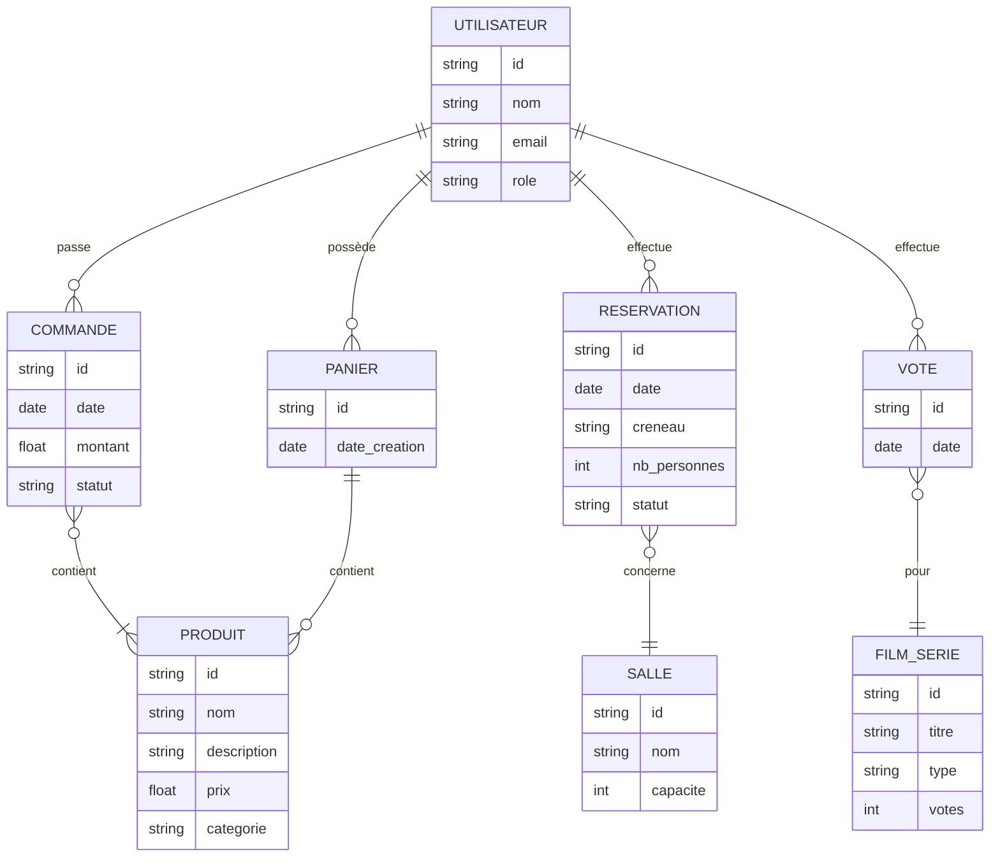
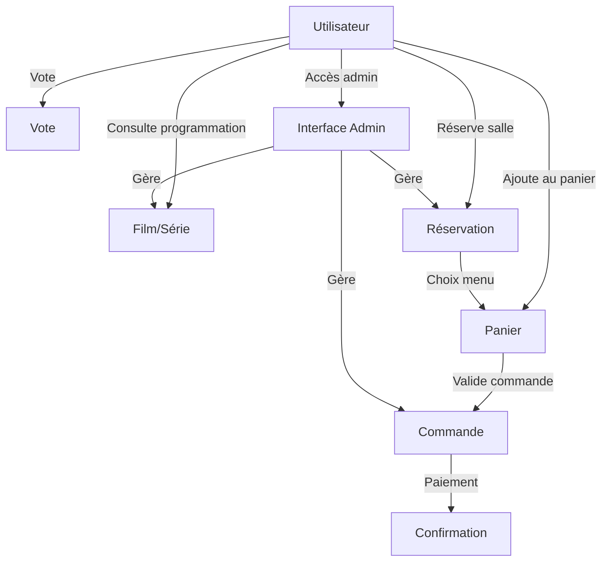

# Étude du Système d'Information (SI) - The Flix n Chill

## Différence entre `.md` et `.mmd` pour les diagrammes Mermaid

- **`.md` (Markdown)** :
  - Fichier de documentation généraliste (README, notes, etc.).
  - Permet d'intégrer du texte, des explications, des listes, des images, et des diagrammes Mermaid dans des blocs de code balisés (```mermaid ... ```).
  - Le rendu graphique du diagramme dépend de l'outil utilisé (VSCode avec extension, Obsidian, Typora, etc.).
  - Idéal pour documenter et expliquer le contexte autour du diagramme.

- **`.mmd` (Mermaid)** :
  - Fichier dédié uniquement au code Mermaid.
  - Utilisé pour générer ou partager des diagrammes Mermaid dans des outils spécialisés (ex : https://mermaid.live/).
  - Ne contient pas de texte explicatif ou de documentation.

## Étude Merise du SI - The Flix n Chill

### 1. Modèle conceptuel des données (MCD)
Le système d'information repose sur les entités suivantes :
- **Utilisateur** (client, admin)
- **Produit** (menu/snack)
- **Commande**
- **Panier**
- **Film/Série** (programmation)
- **Vote**
- **Réservation**
- **Salle** (optionnel)

Les principales relations :
- Un utilisateur passe des commandes et effectue des réservations.
- Une commande contient plusieurs produits.
- Un utilisateur vote pour des films/séries.
- Une réservation concerne une salle et une programmation.

### 2. Flux principaux
- Navigation sur la plateforme (accueil, menu, cinéma, réservation, admin)
- Ajout au panier, validation de commande, paiement
- Consultation de la programmation, vote
- Réservation de salle
- Gestion admin (commandes, réservations, programmation)

---

## Diagramme Mermaid (MCD + flux principaux)





---

**Astuce** : Pour visualiser les diagrammes, ouvre ce fichier dans un éditeur Markdown compatible Mermaid (VSCode avec extension, Obsidian, Typora, etc.) ou copie les blocs Mermaid dans https://mermaid.live/. 